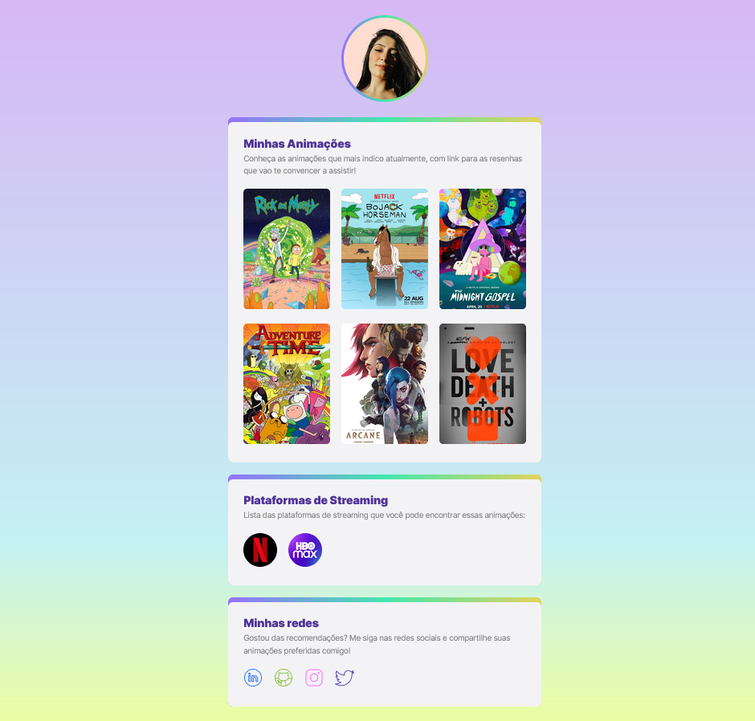

# NLW eSports - Trilha Explorer

## 🚀 Projeto: Minhas Animações

Projeto construído no evento Next Level Week da Rocketseat.

A tela, inicialmente, era de uma página estilo linketree, com links para games e canais de streamers. Porém, resolvi adaptar para uma temática que me identifico mais: séries de animações!

Ao clicar nas imagens, você é redirecionado para resenhas na internet que vão te convencer a assistir o conteúdo!

[Clique aqui parar acessar o projeto!](https://norrana.github.io/nlw-myanimations-explorer/)

## 🔨 Tecnologias:

* HTML;
* CSS;
* Git;
* Github;

## 📧 Contato:

norrana.severo@gmail.com
